## Career Day Talk

### Development Years

My IT career started back in the late 90's when I joined the Army. My MOS \(military occupational skill\) was in mobile communications. 

One of my first assignments was as a small extension node operator

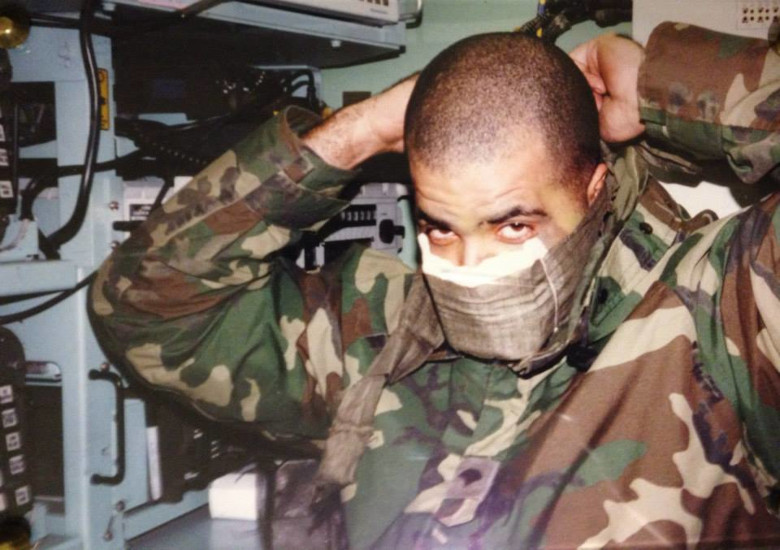

Getting ready to roll out to the field with my team

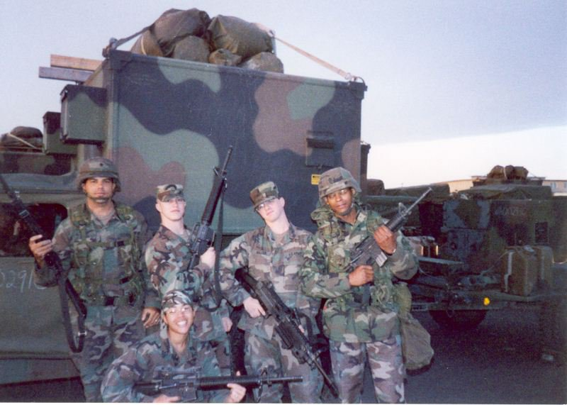

The Army has a great travel plan. Here I'm with my team in Saudi Arabia

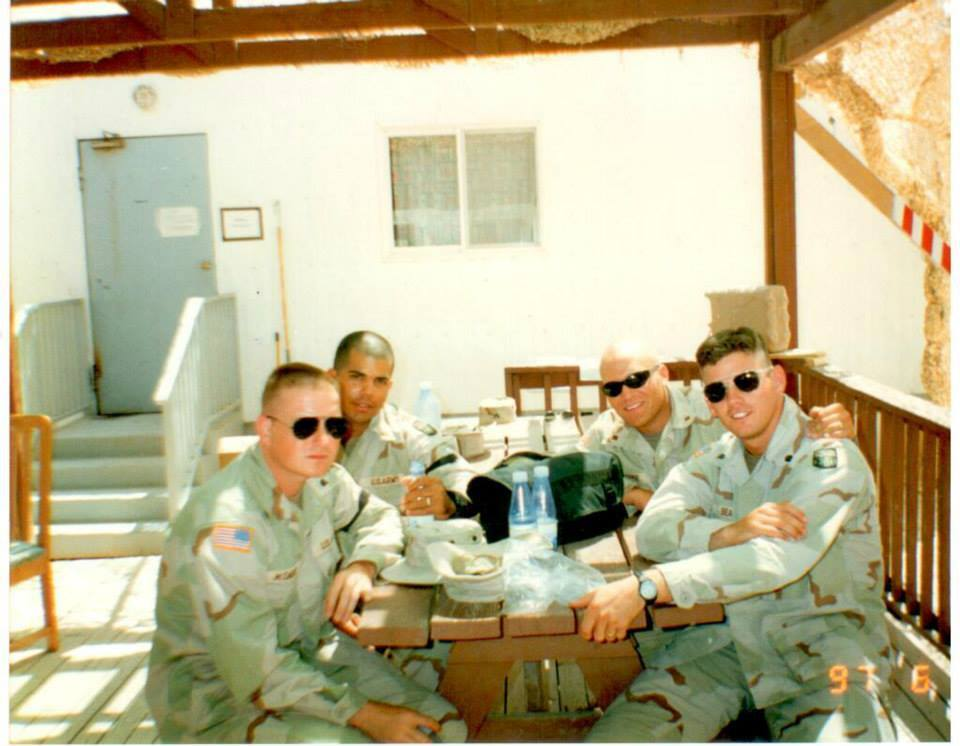

I liked it so much I re\-enlisted

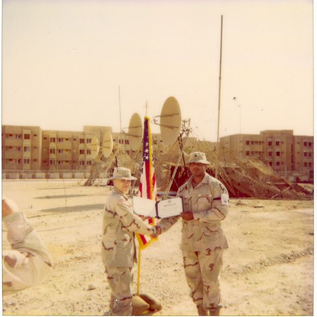

### Code Life

As a coder, it's best to share your knowledge with others. 

Mentoring a hackathon

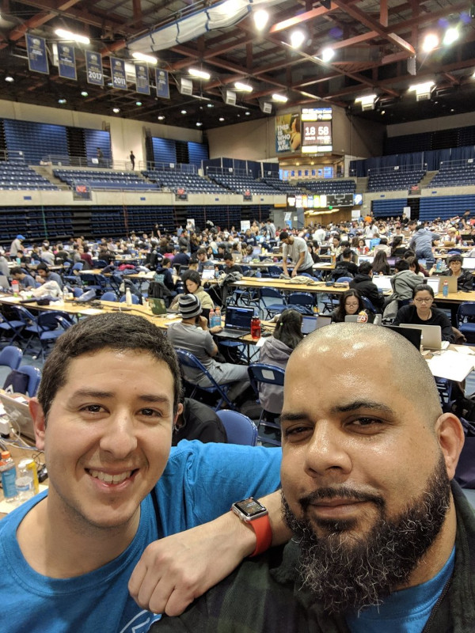

A typical office setup

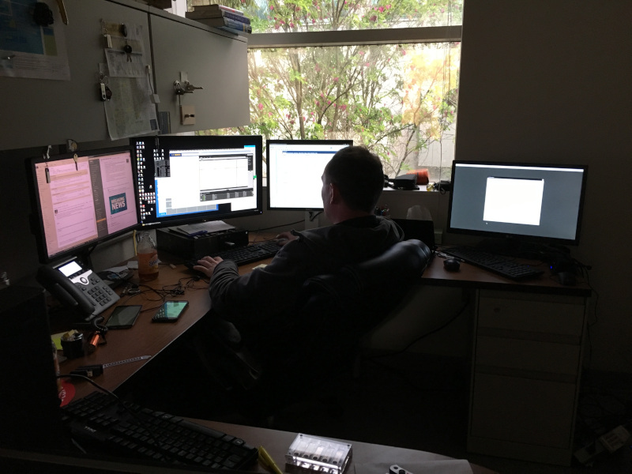

Another office setup

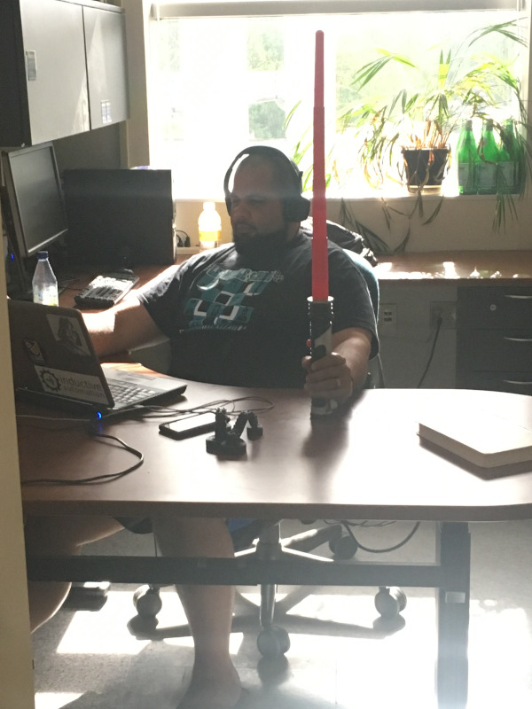

Managing servers

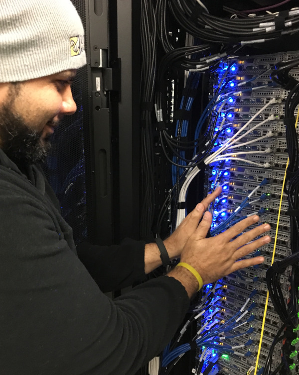

Testing out new technologies

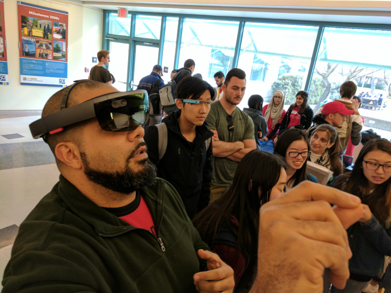

Testing out new games

Taking tests for certifications

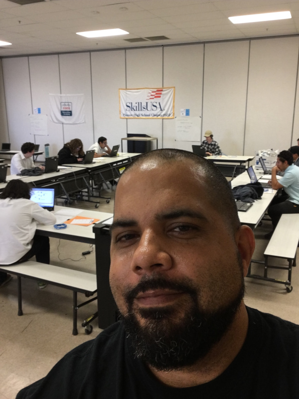

Always be fair when reviewing someone else's code

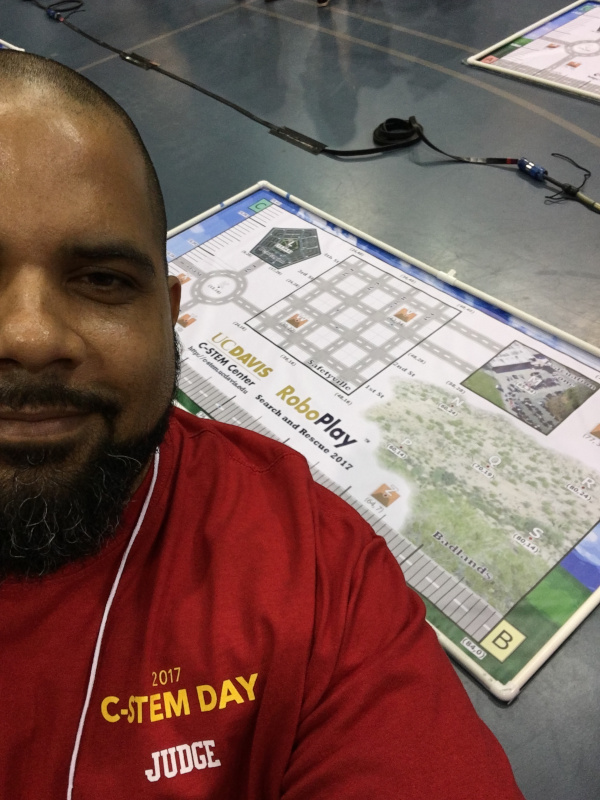

### Code Tutorials
- [Mozilla Developer HTML](https://developer.mozilla.org/en-US/docs/Learn/HTML)
- [Mozilla Developer JavaScript](https://developer.mozilla.org/en-US/docs/Web/JavaScript)
- [w3schools.com HTML](https://www.w3schools.com/html/default.asp)
- [Microsoft Beginner's Series to JavaScript](https://www.youtube.com/playlist?list=PLlrxD0HtieHhW0NCG7M536uHGOtJ95Ut2)
- [Microsoft Python for Beginners](https://www.youtube.com/playlist?list=PLlrxD0HtieHhS8VzuMCfQD4uJ9yne1mE6)
- [Khan Academy Computer Programming](https://www.khanacademy.org/computing/computer-programming)

