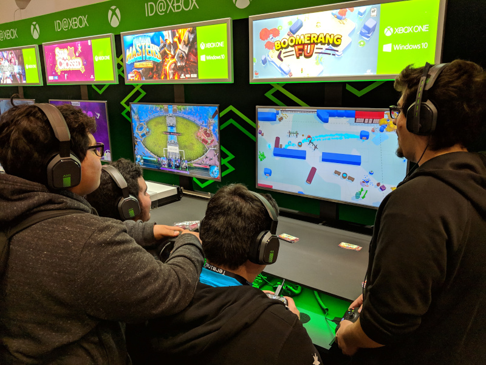

## Career Day Talk

### My Background

My IT career started back in the late 90's when I joined the Army. My MOS \(military occupational skill\) was in mobile communications. Upon leaving the Army, I worked as a contractor for WorldCom configuring remote circuit connections. In 2003, I landed a job as temp at UC Davis. From there things took off and in a few years, I became a network admin with developer duties assigned.

One of my first assignments was as a small extension node operator

Mobile comms ready to roll out

Mentoring a hackathon

Office configuration

Server room maintenance

Testing out new technologies

Chaperoning high school students to the GDC

Taking tests for certifications

Always be fair when reviewing someone else's code

### Code Life

As a coder:

- Always share your knowledge
- You don't know something till you can teach it
- Imposter syndrome is real
- No one knows everything

### Code Tutorials
- [Mozilla Developer HTML](https://developer.mozilla.org/en-US/docs/Learn/HTML)
- [Mozilla Developer JavaScript](https://developer.mozilla.org/en-US/docs/Web/JavaScript)
- [w3schools.com HTML](https://www.w3schools.com/html/default.asp)
- [Microsoft Beginner's Series to JavaScript](https://www.youtube.com/playlist?list=PLlrxD0HtieHhW0NCG7M536uHGOtJ95Ut2)
- [Microsoft Python for Beginners](https://www.youtube.com/playlist?list=PLlrxD0HtieHhS8VzuMCfQD4uJ9yne1mE6)
- [Khan Academy Computer Programming](https://www.khanacademy.org/computing/computer-programming)

